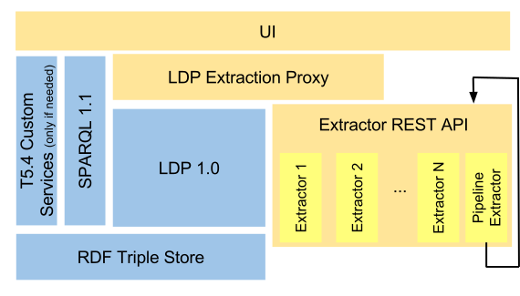
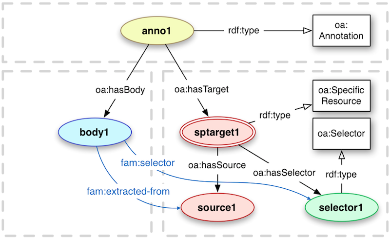
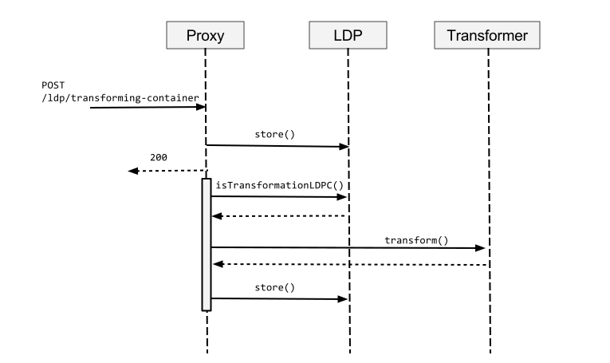

# Technical platform specifications and basic implementation

Deliverable 5.1

## Document History

| Ver.               | Name               | Date               | Remark             |
|--------------------|--------------------|--------------------|--------------------|
| v0.1               | Sergio Fernández   | 08.05.2014         | Created initial structure    |
| v0.2               | Sergio Fernández, Jakob Frank, Reto Gmür | 05.06.2014         | Added content to some main sections  |
| v0.3               | Carl Blakeley, Kingsley Idehen, Rupert Westenthaler, Sergio Fernández   | 16.06.2014         | Integrated contributions from other authors         |
| v0.5|Sergio Fernández, Reto Gmür|25.06.2024|First internal review version|
| v0.6|Sebastian Schaffert, Sarven Capadisli|29.06.201|First intenal review|
| v0.7|All|30.6.2014|Addressed review comments|
| v0.8|Reto Gmür| 8.9.2014 | Reworked overall structure|

## Documentation Information

* *Deliverable Nr Title*: D5.1 Technical platform specifications and basic implementation
* *Lead*: Reto Gmür (BUAS)
* *Authors*: Sergio Fernández, Jakob Frank, Rupert Westenthaler (SRFG), Carl Blakeley, Kingsley Idehen (OGL), Reto Gmür, Adrian Gschwend (BUAS)
* *Publication Level*: Public

### Document Context Information

* *Project (Title/Number)*: Fusepool P3 (609696)
* *Work Package / Task*: WP5 / T5.1 & T5.2
* *Responsible person and project partner*: Reto Gmür (BUAS)

### Quality Assurance / Review

* Danilo Giacomi
* Giuliano Mega

### Official Citation

Fusepool-P3-D5.1

### Copyright

This document contains material, which is the copyright of certain
Fusepool P3 consortium parties.

This work is licensed under the Creative Commons Attribution 4.0 International License. To view a copy of this license, visit http://creativecommons.org/licenses/by/4.0/.

## Executive Summary

The goal of Fusepool P3 project is to make publishing and processing of public data as linked data easy. For this purpose Fusepool P3 develops a set of of software components that integrate seemlessly by well defined API basing on Linked Data Best Practices and the Linked Data Platform standard.

To ensure longevity of the code and the API developed withing Fusepool the software is designed so that the individual components can be used not only as parts of the overall software, but also individually. The arhitecture is not tied to a particular runtime environment but bases exclusively on web standards. This allows components to be implemented using any language and framework.

The Fusepool P3 process is divided in the following four steps: exploration, extraction, enrichment and delivery. The software provides tools for the last 3 steps:

 * Extraction: Data from various sources and formats is transformed to RDF and thus made usable in the Lined Opend Data (LOD) Cloud.
 * Enrichment: Entity recognition, Natural Language Processing (NLP), Interlinking as well as human processing such as by Crowdsourcing allow to enrich the available data increasing its value to its and to application builders.
 * Delivery: The actual delivery of the data can be separated into makinf it available via Lined Data standards and the actual presentation to the user with apps on desktops and mobile devices.

This document describes the modular architecture of the Fusepool P3 platform. It describes the modularization, the available and planned implementations of modules and shows how the modules play together to implement the usecases and provide the toolkit envisaged by the DOW.

Specification for APIs as well as the source code of a running basic implementation form an integral part of this deliverable.

## Acronyms and Abbreviations

| Acronym |                 Description                  |
|---------|----------------------------------------------|
| ABAC    | Attribute Based Access Control               |
| ACL     | Access Control List                          |
| API     | Application Programming Interface            |
| BUAS    | Bern University of Applied Sciences          |
| ETL     | Extract, Transform, Load                     |
| FP3     | Fusepool P3                                  |
| HTTP    | Hypertext Transfer Protocol                  |
| HTTPS   | Secure Hypertext Transfer Protocol           |
| IRI     | Internationalized Resource Identifier        |
| JDBC    | Java Database Connectivity                   |
| JDK     | Java Development Kit                         |
| LDP     | Linked Data Platform                         |
| LDP-BC  | Linked Data Platform Basic Container         |
| LDPC    | Linked Data Platform Container               |
| LDP-DC  | Linked Data Platform Direct Container        |
| LDP-IC  | Linked Data Platform Indirect Container      |
| LDP-NR  | Linked Data Platform Non-RDF Source          |
| LDPR    | Linked Data Platform Resource                |
| LDP-RS  | Linked Data Platform RDF Source              |
| ODBC    | Open Database Connectivity                   |
| OGL     | OpenLink Software Ltd.                       |
| PPO     | Privacy Preference Ontology                  |
| RDF     | Resource Description Framework               |
| RDFS    | RDF Schema                                   |
| REST    | Representational State Transfer              |
| SAIL    | Storage And Inference Layer                  |
| SoC     | Separation of Concerns                       |
| SPARQL  | SPARQL Protocol and RDF Query Language       |
| SQL     | Structured Query Language                    |
| SRFG    | Salzburg Research Forschungsgesellschaft mbH |
| SSL     | Secure Sockets Layer                         |
| TLS     | Transport Layer Security                     |
| URI     | Uniform Resource Identifier                  |
| URL     | Uniform Resource Locator                     |
| VAL     | Virtuoso Access Control                      |
| W3C     | World Wide Web Consortium                    |
| WebDAV  | Web Distributed Authoring and Versioning     |
| WG      | Working Group                                |
| WP      | Work Package                                 |

## Normative namespaces

In this document the prefixes used in [CURIEs](http://www.w3.org/TR/curie/) shall refer the following
IRI prefixed:

| Prefix |                                                                                                                                                                                             Namespace                                                                                                                                                                                              |
|--------|----------------------------------------------------------------------------------------------------------------------------------------------------------------------------------------------------------------------------------------------------------------------------------------------------------------------------------------------------------------------------------------------------|
| rdf    | [http://www.w3.org/1999/02/22-rdf-syntax-ns\#](http://www.w3.org/1999/02/22-rdf-syntax-ns)
| rdfs   | [http://www.w3.org/2000/01/rdf-schema\#](http://www.w3.org/2000/01/rdf-schema)                                                                                                                                                                                                              |
| xsd    | [http://www.w3.org/2001/XMLSchema\#](http://www.w3.org/2001/XMLSchema)                                                                                                                                                                                                                                 |
| dct    | [http://purl.org/dc/terms/](http://purl.org/dc/terms/) |
| oa     | [http://www.w3.org/ns/oa\#](http://www.w3.org/ns/oa#)|
| ldp    | [http://www.w3.org/ns/ldp\#](http://www.w3.org/ns/ldp#)|
| fp3    | [http://vocab.fusepool.info/fp3\#](http://vocab.fusepool.info/fp3#) [TODO: remove]|
| eldp   | [http://vocab.fusepool.info/eldp\#](http://vocab.fusepool.info/eldp#)   |
| trans  | [http://vocab.fusepool.info/transformer\#](http://vocab.fusepool.info/transformer#) |
| fam    | [http://vocab.fusepool.info/fam\#](http://vocab.fusepool.info/fam#) |

## Introduction

This document describes the technical specification for the Fusepool P3 platform. It specifies the Fusepool P3 software by describing the basic architectural design choices and at a different level of precision (depending on the current status of the development of the respective components and work packages) the concrete interaction APIs. It aims to present an application that satisfies the high level requirements of the DoW but also the more concrete usecases developed by WP1. The described architecture is the result of discussion with all technical work packages as it affects all software deliverable of the project and not just  WP5.

The main goal of the Fusepool P3 architecture is to provide interaction protocols and pattern so that the component can be used in concert to form the Fusepool P3 Platform. The interaction is based on HTTP. For the APIs introduced in Fusepool P3 we strive to ashere to the REST design principles. Also we adhere to the Linked Data principles [BernersLee2006](#BernersLee2006). This document also describes some of the workflows to illustate how the APIs and architectural pattern are applied to satisfy concrete usecase.

### Uses cases summary

The Fusepool P3 project partners Provincia Autonoma di Trento and
Regione Toscana publish Open Data and develop apps in the domain of
tourism for several years. During this time both partners gained
valuable experience in data creation, maintenance and publication.

Many of the published Open Data sets are used in Android or iOS apps
aimed at tourists and/or inhabitants of the region. Some of them are
written by the project partners, other apps by 3rd party developers
which integrate parts of the published Open Data into their own apps.

As of today the data is mainly available in particular data formats like
CSV, KML, XML and JSON. App developers need to download the raw data and
process it using their own ETL (Extract, Transform Load) processes. With
every update of the raw data this process has to be triggered for every
single application where it is used. If the format of the raw data
changed, the process has to be adjusted and cannot be automated. With
every new data source, maintenance complexity of these Open Data sets
and its apps increases.

Linked Data can help to solve these problems: Data is made available in
a standard format (RDF) which provides among others the following
benefits[[1]](#ftnt1):

-   Every piece of information (data) has its own identifier (URI/IRI).
-   Those identifiers can be resolved via the web (HTTP),
-   which acts as a generalized API for developers.
-   Standardised vocabularies describe the meaning of the data,
-   and allow to relate information with each other.

The Linked Data technology stack [Bizer2009] provides many ways to
interact with data in RDF format [Cyganiak2014]. This greatly reduces
the overhead needed to integrate data sets into apps and thus increases
the value of Open Data. However, one needs new ETL processes to
transform raw data to Linked Data. While it facilitates data usage for
app developers, Linked Data requires initially more work by the data
owner and publisher.

In the past years many powerful tools got developed or extended to
support creation and maintenance of Linked Data. Also new W3C standards
and vocabularies are developed for turning legacy data into Linked Data.
Many of these tools and standards are developed, extended or implemented
by Fusepool P3 project partners. The emerging Linked Data Platform Standard (LDP)[[7]](#ftnt7) provide standardized means for making collections of linked data resources
accessible.

What is lacking is an integration framework that combines the data transformation to RDF, possible enhancement steps and the publishing of the Linked Data. Fusepool P3 will provide such an integration framework along with User Interface tools that serve both to model the data publication process as well as to coordinate the human interactions that might be required while the data is processed.

This framework will integrate state-of-the-art tools like OpenRefine, OpenLink Virtuoso, Apache Stanbol, and Pundit. The famework is developed and tested based on the requirements by our project partners Provincia Autonoma di Trento and Regione Toscana. Both partners start working with the platform in an early stage and feedback
gets directly integrated into the agile development process of Fusepool
P3.

## Architecture

The architecture is based on components communicating via HTTP and exposing RESTfull APIs. This allows for components being developed in any language and hosted on any platform. After initial discussions on the architectural principles (see [[2]](#ftnt2) and [[3]](#ftnt3)) the decision was taken to have the components very loosly coupled and interacting only via HTTP, this design choice was made with the following goals:

- Reusability of Fusepool component is maximized
- Distributed development is facilitated
- It is easy for developer to understand and extend the software
- Ensure longevity of the software
- The software is simple to deploy and maintain in organizational IT environments (DoW 1.2.2)

Once the decision was taken on how components should interact the question was were the boundaries between components should be defined and how the components build the overall platform. The following figure depicts the high-level architecture for the Fusepool P3 platform:

The diagram shows how the UI and other clients access the fusepool P3 primarily via and LDP transforming Proxy which exposes a front-end conforming to the LDP specification [Speicher2014] with the addition of the Transforming Container API [TODO link]. The proxy transparently handles
transformation processes by calling in background the actual transformers, and sending back the data to the platform once the process has finished. The clients can also directly access transformers via their REST API (transfomer API) [TODO link] or use a SPARQL 1.1 [SPARQL11] endpoint.

As the name suggests transformer data. The term ans the API are used broadly both for the functionality provided by WP 2 as well as by WP 3. It comprises the transformation from non-RDF content to RDF as well as the transformation from content without annotations to content with annotations.

The components drawn in blue are not actually separable components that interact via HTTP. While an LDP implementation could in principle interact with the RDF Triple Store exclusively via SPARQL and HTTP for performance reasons it is not implemented this way but is rather more tightly coupled to the implementation of the triple store. Similarly some custom services realized in T5.4 will be implemented to directly interact with the triple store; such services are only implemented if the development of the UI shows that an interaction via the standard mechanism SPARQL and LDP is not feasible or not providing an adequate level of performance.

For the implementation of LDP (without the transforming container API) the concrete implementations that the partners bring into the consortium are Apache Marmotta^[[4]](#ftnt4)^ from SRFG and
OpenLink Virtuoso^[[5]](#ftnt5)^ from OGL. With the exception of the T5.4 components any generic LDP implementation that supports read/write access can be used. Some more concrete details about the requirements for such implementations will be described below.

All components are going to be described in sufficient detail in the upcoming sections.

To summarize: This architecture does not make the platform the common runtime for all
components. On the contrary, by default each component, including all
transformers, are individual processes interacting via HTTP as the
interaction interface. An exception to this are the backend related
components (LDP, SPARQL, RDF Triple Store and the possible custom
backend services) which may be more tightly coupled between themselves
(i.e., running under the same runtime) due to non-functional
requirements.

### Components

The Fusepool P3 platform is composed of four core components: clients, the LDP Transforming Proxy,
transformers and backends.

#### Clients

From the point of view of the platform, clients will be all those
components of the project interacting with the platform. They mainly
will use standard interfaces, such as LDP or SPARQL, that allow the
final users[[6]](#ftnt6) to use the platform in a seamless way.

Further details will be described in WP4’s deliverables.

#### Transformers

Data transformation components are responsible for transforming data
from legacy formats (e.g. structured formats like vCard or Facebook
OpenGraph, or unstructured formats like plain text) to RDF. The can also
transform data without changing it's format such as by adding or refining annotations.

As the term "transform" and the derived terms are used very broadly here; it includes processes such
as annotating and RDFizing content. Therefore, from the nature of
the transformation tasks, in the current scope we can differentiate
at least two families of transformers: RDFizers which transform non-RDF data to RDF and annotators  which enrich with RDF annotations data in any format. While RDFizers
produce RDF data using the ontologies best suited for the concrete data (e.g. FOAF for data describing persons), annotators will used a common set of ontologies as to describe annotations in a common way.

Transformers are identified by an URI which is the entry point of the RESTfull transformation API. Very often a single HTTP Server will provide many related transformers. For example a server on host `translate.example.org` might provide an a transformer translating from English to German with URI `http://translate.example.org/en/de` and another transformer translating from Esperanto to Klingon at URI `http://translate.example.org/eo/tlh`. Such a software providing many transformers is called *transformer factory*.

The transformer API supports both synchronous and asynchronous transformers. While a synchronous transformer return the transformation result right as the response of the transformation request asynchronous transformer will deliver their results at a later time. Asynchronous transformers might for instance require some user interaction in order to deliver their results.

Transformers may invoke other transformers, we provide a transformer factory to create pipeline transformers. A pipeline transformers invokes a list of transformers in sequence passing the output of one tranformer as input to the next transformer and at the end retuning the output of the last transformer. For example this allows to chain a transformer translating the content with a transformer that does named entity extraction, which would be useful if no entity labels are available in the original language.

#### LDP Transforming Proxy

Fusepool P3 defined the Transforming Container API. This API bases on LDP and provides a way to describe containers (LDPCs) that transform data that is added to such a container by passing it to a transformer.

While it is possible for an LDP implementation to implement this API directly it would be hard to convince vendors of LDP implementations to add support for Transforming Containers, especially as long as this API is hardly known and there are few transformers available. As the API won't become more widely known as long as it is isn't supported this is a prototypical catch-22 situation.

To break out of this dilemma we implemented th P3 Transforming Proxy. This is an HTTP Proxy that is used as a reverse proxy in front of an LDP Server and adds the capabilities described by the Transforming Container LDPC to the proxied instance. The proxy intercepts POST requests: if the request is against an LDPC marked as Transforming Container the proxy will not only forward the request to the proxied LDP instance but also send the contents to the transformer associated to the container. Once the result of the transformation is available the results will also be posted to the LDPC. Of course, the LDPC can be associated to a pipeline transformer if multiple transformers should be executed.

#### Backends

All data is persisted to the underlying backend server, which provides
the support for the generic interfaces (LDP and SPARQL) and where the
data will be persisted in a RDF Triple Store. Both Marmotta and Virtuoso
will provide a concrete implementations of this generic component.

### APIs and specifications

Components communicate via REST [Fielding2002] over HTTP [Fielding1999]
between each other. RDF is used as data model and exchange format in most communications (SPARQL is an exception of this rule). All standard serializations may be potentially used, Turtle [Prudhommeaux2014] is supported by all components implemented within the project.

Interaction between the components as well as with external clients is regulated by the following specifications:

 * LDP
 * SPARQL
 * Transformer API
 * Transforming Container API
 * User Interaction Request API
 * Fusepool Annotation Model (FAM)

Some other APIs are yet to be defined.

#### LDP

Linked Data Platform 1.0 [Speicher2014], commonly abbreviated as LDP, is
a W3C technology which proposes to use HTTP for accessing, updating,
creating and deleting resources from servers that expose their resources
as Linked Data. It provides clarifications and extensions of the rules
of Linked Data [BernersLee2006]. LDP uses standard HTTP and RDF
techniques for constructing clients and servers that create, read, and
write Linked Data Platform Resources (LDPR). The specification defines a
special type of Linked Data Platform Resource: a Container (LDPC).
Containers are very useful in building application models involving
collections of resources, often homogeneous ones. Resources can be added
to containers using the standard HTTP POST method.

Besides a general purpose LDP 1.0 implementation compliant with the
specification[[11]](#ftnt11), for the concrete needs of the project it
has to provide at least:

-   Implementation must support the creation of (nested) containers by posting
    them to an existing container.
-   In addition to the normative LDP properties, the description of an LDPC shall be allowed
    to contain arbitrary properties.
-   Further more, the underlying LDP implementation has to support to
    transparently run behind the LDP Proxy, concretely this means the
    LDPC must not assume the requested IRI to reflect the port it is
    listening to.

LDP Specification: [http://www.w3.org/TR/ldp/](http://www.w3.org/TR/ldp/)

#### SPARQL 1.1

All Data in the RDF Graphs managed by a Fusepool P3 platform backend can be accessed via SPARQL 1.1 [SPARQL11]. SPARQL is the standard query language for RDF triple stores. While the LDP access allows for browsing the data SPARQL allows to run queries of arbitrary complexity against the data.

Sparql Specifications: [http://www.w3.org/TR/sparql11-overview/](http://www.w3.org/TR/sparql11-overview/)

#### Transformer API

The transformer API defines a RESTfull and RDF based API for data transforming components. It supports both synchronous and asynchronous execution of the data transformation tasks. While similar APIs aree provided by other projects such as by Apache Any23 ([Apache Any23 REST Service](http://any23.apache.org/service.html)) or by Apache Stanbol ([Apache Stanbol Enhancer RESTful API](http://stanbol.apache.org/docs/trunk/components/enhancer/#RESTful_API)) none of these APIs offered the required flexibility. We hope that the advantages of the API we propose, like the RDF service description and the possibility of asynchronous execution will convince other communities to adopt it or might contribute to a new and more broadly accepted standard.

The Specification for the Transformer API is an annex to this deliverable and also available in its latest version at: [https://github.com/fusepoolP3/overall-architecture/blob/master/transformer-api.md](https://github.com/fusepoolP3/overall-architecture/blob/master/transformer-api.md)

#### Transforming Container API

The Transforming Container API is defined as an extension to the LDP specification to allow special containers to execute a Transformer when a member
resource is added via a POST request. This allows to automatically Transform documents when they are added to a Linked Data Platform Container (LDPC).

Basically the process is such: if the representation contains a triple
with the LDPC as subject and eldp:transformer as predicate, an
implementation invokes the trans:Transformer identified by the
object of this triple whenever a LDP-NR is created following a POST
request to the Transformer LDPC. The results of the transformation will be added to the same container.

The Specification for the Transforming Container API is an annex to this deliverable and also available in its latest version at: [https://github.com/fusepoolP3/overall-architecture/blob/master/transforming-container-api.md](https://github.com/fusepoolP3/overall-architecture/blob/master/transforming-container-api.md)

#### User Interaction Request API

Some components such as transformers may require some user interaction at some points of processing. While components are free to get a users attention in any way (such as by sending emails) the user interaction request API allows to request for user attentions in a unified way allowing all requests for interaction showing up in a cockpit UI-Application.

The User Interaction Request API describes how an LDPC is used to maintain a registry of requests for interaction. Components submit a URI to this registry and remove the URI once the interaction completed. The UI component provides the user a link to the submitted URI. The component is free to present any web-application at that URI suitable to perform the required interaction.

The Specification for the User Interaction Request API is an annex to this deliverable and also available in its latest version at: [https://github.com/fusepoolP3/overall-architecture/blob/master/user-interation-request-api.md](https://github.com/fusepoolP3/overall-architecture/blob/master/user-interation-request-api.md)

#### Fusepool Annotation Model (FAM)

In Fusepool P3 annotators are expected to produce annotation from
textual content, either unstructured or extracted from any other
structured format. All annotators produce RDF using a common annotation model
as described by this section. This is important to pipe annotators,
allowing configurations using multiple annotation services.

The base structure of this Annotation Model will be fully compatible
with Open Annotation [Sanderson2013], but defining some additional
relations to ease the consumption - especially the retrieval of
Selectors for Annotations. The following figure provides an overview on
the chosen model.

Annotations describe (annotate) associations between related resources.
An annotation based on the Fusepool P3 Annotation Model will consist of
the following parts:

-   oa:Annotation providing metadata and provenance information about
    the produced annotations
-   oa:SpecialResource acting as mediator between the optional
    oa:Selector and the source
-   the source represented by the IRI of the annotated text
-   an annotation body that formally describes the annotation

A fam:selector property is introduced to provide a shortcut between the
annotation body and the 0..\* selectors. The fam:extracted-from property
provides a direct link between the annotation body and the source. Those
two properties allow a annotation body centric consumption of annotator
results. Then clients, instead of manually joining over the intermediate
resources (?annotation and ?sptarget) with a SPARQL query like:

    PREFIX oa: \<http://www.w3.org/ns/oa\#\>
    SELECT ?body ?source ?selector
    WHERE {
      ?annotation a oa:Annotation ;
        oa:hasBody ?body ;
        oa:hasTarget ?sptarget .
      ?body a fam:TextAnnotation ;
        oa:hasBody ?body .
      ?sptarget oa:SpecificResource ;
        oa:hasSource ?source ;
        oa:hasSelector ?selector .
    }

Instead they can directly retrieve the required information with a much
simpler and faster query:

    PREFIX oa: \<http://www.w3.org/ns/oa\#\>
    PREFIX fam: \<http://vocab.fusepool.info/fam\#\>

    SELECT ?body ?source ?selector
    WHERE {
      ?body a fam:TextAnnotation ;
        fam:extracted-from ?source ;
        fam:selector ?selector .
    }

In addition to this core structure model the Fusepool Annotation model
also defines a set of Annotation Types for the annotation of different
analysis results:

1.  Language Annotation: used to describe the Language of the analysed
    text
2.  Text Annotation: used to describe Named Entities detected in the
    text. Such entities can originate from Named Entity Recognition
    (NER) tools annotators that detect mentions of Entities based on
    Dictionaries
3.  Entity Annotation: used to suggest Entities part of some kind of
    controlled vocabulary for mentions in the text. Entity Annotations
    are suggestions for Text Annotations. The oa:Choice construct is
    used for modelling those
4.  Topic Annotation: used to classify a document along topics defined
    in some classification scheme (e.g. skos:Concepts part of a
    skos:ConceptScheme)

All those Annotation Types will act as annotation bodies as defined in
the core annotation structure. Annotation Types are extensible. This
allows Annotations whose analysis results are not covered by the
predefined Annotation Types to define their own.

This section defines the first version of the Fusepool P3 Annotation
Model[[19]](#ftnt19), which will be specified in detail in the future
by deliverable D5.2, Data retrieval for semantic enrichment/processing
and semantic indexes for domain specific data retrieval.

#### More specification

Following an agile development approach specification of the application is an ongoing process. Currently some more specification are foreseen:

 * Transformer Registry
 * Transformer Factory Registry

The *Transformer Factory Registry* allows the UI to point the user to a webapplication allowing the creation of Transformers, such an application might require to choose a taxonomy in the case of an entity recognizing annotator. In the case of the application to create a pipeline transformer the user will have to choose transformers and put them in the right order, this application will use the *Transformer Registry* to show the available transformers.

These registries will be modeled in a similar way as the *User Interaction Request API* described above. So rather than introducing new components the regular LDP capabilities are used to maintain these registries.

## Access control

Access Control is a mechanism through which an agent (in this case the
platform) permits to perform certain operations on resources as
specified by concrete policies. Within this document, the resources are
RDF resources, exposed either by LDP or SPARQL, and the access control
will not operate at a different granularity (graphs or triples). When
access control come into play, the platform must restrict some
operations on some resources. These operations are the typically
described by the RESTful principles.

Access control is a recognized open issue when interacting with RDF /
Linked Data using HTTP methods [Costabello2013], and LDP 1.0 is not yet
seriously addressing such issue^[[20]](#ftnt20)^. Therefore please
notice that the platform will not go beyond the state of the art on this
aspect; i.e., we are not going to provide a new access control proposal.
But the Fusepool P3 platform is just going to implement the best
possible solution for the goals of the project among the different
alternatives already available out there.

Given the proposed architecture, where all the interaction to the
platform is done via the LDP Transformation Proxy Layer (further details
can be found at Sections 2.1 and 3.1), access control not relying on
HTTP Headers (e.g. WebID) must be at least partially be handled by a
proxy handling the requests as they come in^[[e]](#cmnt5)^. This means
that a HTTPS proxy might handle the request before the requests are
processed by the LDP Transformation Proxy described above. This HTTPS
Proxy can of course rely on information stored in the proxied LDP
implementation describing the users and their rights. Following the
design principle of Separation of Concerns (SoC) the LDP Transformation
Proxy only implements HTTP, no TLS/SSL support over HTTPS.
^[[f]](#cmnt6)^^[[g]](#cmnt7)^^[[h]](#cmnt8)^^[[i]](#cmnt9)^Therefore
such circumstance needs to be properly handled when designing the access
control mechanisms. For all these reasons, access controls is not yet
part of the basic implementation delivered together with this report.
There are still many issues to clarify before we would be able to
provide a specification that could fit in the overall architecture.

The access control mechanisms of the particular Linked Data Platform
(Apache Marmotta or OpenLink Virtuoso) providing the base layers of the
FP3 framework (the blue components in the architecture diagram on
Section 2), are likely to be vendor specific to some degree. The
following sections describe the concrete access control features which
could be used by the Fusepool platform. Whether a generic access control
interface could be defined for the FP3 platform remains an item for
discussion^[[j]](#cmnt10)^. Such a generic interface would seek to hide
differences in access control configuration between the alternative
Linked Data platforms which might provide the base storage layer. In the
absence of a generic interface, the access control configuration might
remain platform specific, but the effects of the access control as seen
by the client, for example the reporting of access restrictions, should
be consistent irrespective of the chosen storage platform.

#### Marmotta access control

Apache Marmotta implements some basic mechanisms for access control. By
default HTTP Basic authentication [Fielding1999] is used for
authentication and authorization^[[21]](#ftnt21)^, both for all web
services (SPARQL, LDP, etc) and the administration user interface. The
configuration is based on ACL rules, using users and roles, grouped in
profiles for simplifying permission management.

In addition, Marmotta also has experimental support for fine-grained
access-control within the RDF triples^[[22]](#ftnt22)^ by providing
access control over a Sesame SAIL using PPO [Sacco2011]. Although in
principle such granularity level of access control would not be required
by the project, as discussed above. The roadmap of the project also
includes other authentication technologies, such as
WebID^[[23]](#ftnt23)^ or OAuth^[[24]](#ftnt24)^, which also could be
addressed with the implementation of the Fusepool P3 platform. In the
end the evolution of the requirements, both internal in the project and
external^[[25]](#ftnt25)^, should guide that process.

#### Virtuoso access control

Virtuoso provides numerous options for access control - some specific to
a particular realm. For instance:

-   Protected SPARQL endpoints associated with specific authentication
    methods, e.g. /sparql-auth, /sparql-oauth, /sparql-webid
    [Fielding1999, Hardt2012, Story2009, Recordon2006].
-   SPARQL roles restrict the types of SPARQL commands a database user
    may perform.
-   Graph level security allows the setting of permissions bit masks to
    set the read/write (and sponge) permissions on specific RDF graphs
    to control public access or specific users.

However, OpenLink’s preferred generic access control mechanism for
Virtuoso is VAL, its Virtualized Authentication Layer^[[26]](#ftnt26)^.
VAL provides a virtualized layer that loosely couples: Identifiers
(WebIDs  that denote Agents), Identification (WebID-Profile documents
that describe Agents), Authentication (WebID-TLS and other protocols for
Identification claims verification), and Authorization (via the use of
ACLs or Data Access policies represented in RDF). VAL enables protection
of any HTTP and SQL (via ODBC or JDBC connections) accessible
resource(s). Thus, it provides the basis for controlling access to LDP
resources exposed by the Virtuoso LDP, for protecting Virtuoso SPARQL
endpoints or specific RDF store named graphs, or WebDAV resources etc.

##### VAL vs LDP WG Requirements for Access Control

VAL offers a superset of the LDP access control requirements outlined by
the Linked Data Platform Working Group^[[27]](#ftnt27)^. It broadly
supports the following W3C requirements:

-   Access Control Graphs - which describe which agents have access to
    which resources and the modes of access allowed.
-   Access control on HTTP manipulation of resources.
-   Editability of access control rules using HTTP.
-   Agents can authenticate themselves to the server with an identifier
    or as the owner of a token.
-   Ability to specify access privileges at a fine-grained level.
-   Ability to specify a collection of agents or resources, identified
    by IRIs or IRI patterns.

##### Virtuoso Authentication Layer (VAL)

VAL provides both authentication and access control services through an
internal Virtuoso API or by two public HTTP APIs, a ‘standard’ HTTP API
and a RESTful variant, which manage rules and groups via their URLs.
Both are Turtle-based. All the VAL authentication mechanisms are
supported.

Users attempting to access a VAL-protected resource must first login and
authenticate themselves through a VAL-supplied authentication dialog.
After establishing a VAL session, their access permissions on the
resource are checked. Virtuoso LDP resources and containers could be
protected in this way, once the required VAL hooks are in place.

The supported authentication methods are:

-   HTTP authentication (for Virtuoso SQL and WebDAV user accounts)
-   Basic PKI, BrowserID, OpenID, WebID-TLS
-   Third party OAuth services:

-   Numerous services including Facebook, Twitter, LinkedIn and Google.
-   Note: Not all OAuth services require a Virtuoso SSL endpoint. Such
    services would remove the need for the LDP Transformation Proxy to
    support HTTPS.

VAL’s generic ACL layer is based in its entirety on RDF statements and
entity relations logic, so rules, groups, authorization grants etc., are
all in the form of RDF statements persisted to  private graphs in the
RDF store. Authorization rules are described using terms from the  W3C
ACL ontology^[[28]](#ftnt28)^ and the OpenLink ACL
ontology^[[29]](#ftnt29)^. This system also supports restrictions which
restrict arbitrary values based on the authenticated user. These can be
used to limit the number of query results, enforce quotas etc.

VAL ACL Rule System Overview

The ACL rule system allows any authenticated person (including any
3rd-party service IDs which have no corresponding Virtuoso SQL account)
to create ACL rules for any resource they own or they have grant rights
for. A resource is any entity identified by a IRI. This could be an LDPR
or LDPC, or an transformer. VAL manages and reports the permissions on
the resource, but the logic supporting the resource access is
responsible for enforcing those permissions.

Rules and groups are stored in private named graphs within the triple
store, as are resource ownership details. The rules grant read, write or
sponge permission on a resource, or the ability to grant these
permissions. Custom permissions can also be defined.

Below is a basic example of an ACL rule granting read access to a
user authenticating through their Facebook login,
`http://www.facebook.com/jsmith`, to
resource `http://demo.fusepoolp3.eu/assets`:

    @prefix oplacl: \<http://www.openlinksw.com/ontology/acl\#\> .
    @prefix acl: \<http://www.w3.org/ns/auth/acl\#\> .

    \<\#rule\> a acl:Authorization ;
      oplacl:hasAccessMode oplacl:Read ;
      acl:agent \<http://www.facebook.com/jsmith\> ;
      acl:accessTo \<http://demo.fusepoolp3.eu/assets\> ;
      oplacl:hasScope \<urn:myscope\> .

In addition to individual person ACLs granting access to an individual,
rules can grant access to a simple group, a conditional group, or
everyone, i.e. make a resource public. Rather than consisting of a list
of members, conditional groups define a set of conditions. These
conditions typically test attributes of the X.509 client certificate
provided by the authenticated user’s WebID, but can also be conditions
evaluated as part of a SPARQL ASK query. Every authenticated person
matching these conditions is seen as part of the group. VAL’s
Conditional Groups feature provides the basis for Attribute Based Access
Control (ABAC^[[30]](#ftnt30)^).

## Workflows

This section shall illustrate concrete interaction with the P3 software.

### Registration of a transformer

The exact vocabularies and usage have not yet been specified, the
following should just give an idea in which direction development is
going.

The registration of transformers is done by using a regular LDP
Interaction Model. The Fusepool P3 platform will register a LDP
Container for known transformers. This registry is used by the client
when creating transformation containers as well as when creating
pipeline transformers.

The following HTTP traces outline some more details about this process.
The necessary request to register a new transformer in the platform,
using the HTTP Slug header [RFC5023] according LDP to request "example"
as unique identifier, would be something like:

    POST /registry
    Host: demo.fusepoolp3.eu
    Slug: example
    Content-Type: text/turtle
    @prefix dct: <http://purl.org/dc/terms/> .
    @prefix fp3: <http://vocab.fusepool.info/fp3#> .
    <> a fp3:RegistryEntry;
        fp3:entry <http://example.org/vcard-transformer>.
    <http://example.org/vcard-transformer> a fp3:TransformationService ;
        dct:title "An example vCard transformer"@en.

the included transformer description HTTP request message body, using
the RDF serialization specified by the Content-Type header. Then, the
response would look like:

    HTTP/1.1 201 Created
    Server: FusepoolP3/0.1.0 (build 2+)
    Last-Modified: Mon, 16 Jun 2014 08:54:14 GMT
    ETag: W/"1402908854000"
    Location: http://demo.fusepoolp3.eu/registry/example
    Content-Length: 0
    Date: Mon, 16 Jun 2014 08:54:14 GMT

Then, a request to the new entry:

    GET /registry/example
    Host: demo.fusepoolp3.eu
    Accept: text/turtle, application/rdf+xml;q=.8, \*/\*;q=.1

will return something like:

    HTTP/1.1 200 OK
    Date: Mon, 16 Jun 2014 08:57:32 GMT
    Connection: close
    Content-Type: text/turtle
    @prefix dct: \<http://purl.org/dc/terms/\> .
    @prefix fp3: \<http://vocab.fusepool.info/fp3\#\> .
    \<http://demo.fusepoolp3.eu/registry/example\> a fp3:RegistryEntry ;
        fp3:entry \<http://example.org/vcard-transformer\> .
    \<http://example.org/vcard-transformer\> a fp3:TransformationService ;
        dct:title "An example vCard transformer"@en .

### Registrering a transformer factory

Similar to the above but what is registered are the IRI of transformer
factory. This IRI, http://service.example.org/openrefine in the example
from Section 2.1.2, dereferences to a representation suitable to be
used by a human to create a transformer, ideally a HTML document.

A transformer is identified by a IRI. While it is possible that a
transformer is an individual implementation, it is also common that the
implementation is rather a transformer factory, that is a service that
requires additional configuration for actually providing a transformer.
This additional configuration is typically encoded in the IRI of the
resulting transformers. For example a tranformer for the OpenRefine rule
file located at http://example.org/rules might have the IRI
http://service.example.org/openrefine?rules=http://example.org/rules the
transformer factory could have the  IRI:
http://service.example.org/openrefine, it is important to note that the
latter IRI does not identify a transformer. Transformers provided by the
same transformer factory will typically share the same runtime. Note
that the choice of runtime is up to the implementation. In this
architecture there are no requirement on the runtime environment, as
long as it implemented the Transformation REST API.

### Creating a Transforming Container

LDP does not specify how containers are created. Whatever means, the
underlying LDP implementation supports to create container that as
suitable method to create transformation containers. It should allow to
add an fp3:transformer property linking the transformer from the created
container. A Fusepool P3 compliant LDP implementation MUST support the creation of containers by posting them
to the transformers root container.

    POST /ldp
    Host: demo.fusepoolp3.eu
    Slug: transforming-container
    Content-Type: text/turtle
    @prefix dct: \<http://purl.org/dc/terms/\> .
    @prefix fp3: \<http://vocab.fusepool.info/fp3\#\> .
    @prefix eldp: \<http://vocab.fusepool.info/eldp\#\> .
    \<.\> a eldp:TransformationContainer , ldp:DirectContainer ;
        :transformer \<http://example.org/vcard-transformer\> .

The server response MUST have status code 201 and MUST contain a
location header specifying the IRI of the created resource

    HTTP/1.1 201 Created
    Server: FusepoolP3/0.1.0-SNAPSHOT (build 2+)
    Last-Modified: Mon, 16 Jun 2014 08:54:14 GMT
    ETag: W/"14028798789"
    Location: http://demo.fusepoolp3.eu/ldp/transforming-container
    Link: \<http://p3.fusepool.eu/transformation\>; rel="describedby"
    Link: \<http://www.w3.org/ns/ldp\#Container\>; rel="type"
    Link: \<http://vocab.fusepool.info/eldp\#TransformationContainer\>;
    rel="type"
    Content-Length: 0
    Date: Mon, 16 Jun 2014 08:54:14 GMT

In the above example the response contains some additional information:

-   The Link header with rel="describedby" may indicate some
    implementation restrictions, in this case all details around the LDP
    Transformation Proxy that will be described with more detail in
    following sections of this document.
-   The Link headers with rel="type" indicates the type of the created
    resource in the  LDP hierarchy, where the Fusepool P3 workflow adds
    a non-normative type denoting the extended interaction model.

A GET request to the newly created container at
http://demo.fusepoolp3.eu/ldp/transforming-container could look like
this:

    GET /ldp/transforming-container HTTP/1.1
    Host: demo.fusepoolp3.eu
    Accept: text/turtle; charset=UTF-8
    Prefer: return=representation; include="http://www.w3.org/ns/ldp#PreferEmptyContainer"

Response:

    HTTP/1.1 200 OK
    Content-Type: text/turtle; charset=UTF-8
    ETag: "\_87e52ce2917987"
    Content-Length: 477
    Link: \<http://www.w3.org/ns/ldp\#Container\>; rel="type"
    Preference-Applied: return=representation

    @prefix dcterms: \<http://purl.org/dc/terms/\> .
    @prefix ldp: \<http://www.w3.org/ns/ldp\#\> .
    @prefix fp3: \<http://vocab.fusepool.info/fp3\#\> .
    @prefix eldp: \<http://vocab.fusepool.info/eldp\#\> .

    <http://demo.fusepoolp3.eu/ldp/transformation/example>
      a eldp:TransformationContainer, ldp:DirectContainer ;
      dcterms:title "An transformation LDP Container for vCard" ;
      ldp:membershipResource
    <http://demo.fusepoolp3.eu/ldp/transformation/example> ;
      ldp:hasMemberRelation ldp:member ;
      ldp:insertedContentRelation ldp:MemberSubject ;
      dp:transformer \<http://example.org/vcard-transformer\> .

With a supported RDF format in the Accept header the request MUST yield
to a response entity serializing a graph with at least the triple with
the fp3:transformer predicate.

###  Adding content to a Transformer Container

Data is ingested in the platform also using regular LDP interaction. The
proxy transparently handles the transformation process, normally when
posting LDP-NRs (Linked Data Platform Non-RDF Source resources) to the
special transformation containers. The following sequence diagram
depicts the high-level interaction for a transforming container using a synchronous transformers:

Coming down into more detail, in the case of a synchronous
transformation, the client HTTP interaction is rather simple. The client
posts data to the LDPC:

    POST /ldp/transformation/example
    Host: demo.fusepoolp3.eu
    Accept: text/turtle, application/rdf+xml;q=.8, \*/\*;q=.1
    Content-Type: text/vcard
    Slug: corks
    Content-Length: 164
    BEGIN:VCARD
    VERSION:4.0
    FN:Corky Crystal
    NICKNAME:Corks
    TEL;TYPE=home,voice;VALUE=uri:tel:+61755555555
    EMAIL:corky@example.com
    REV:20080424T195243Z
    END:VCARD

And it gets back the the IRI of the newly created resource

    HTTP/1.1 201 OK
    Date: Mon, 16 Jun 2014 09:01:52 GMT
    Connection: close
    Location: http://demo.fusepoolp3.eu/ldp/transformation/example/corks

The newly created resource will immediately be a member of the
container. The results of the transformer will be available as a member
of the container after the transformer terminates the transformation.
Internally the proxy handles the invocation to the endpoint provided by
the concrete transformer, and the storage of the data.

So when a GET request is sent after transformation completed the
interaction might look as follows:

    GET /ldp/transformation/example HTTP/1.1
    Host: demo.fusepoolp3.eu
    Accept: text/turtle; charset=UTF-8

And the response SHOULD look like:

    HTTP/1.1 200 OK
    Content-Type: text/turtle; charset=UTF-8
    ETag: "\_87e52ce2917987"
    Content-Length: 477
    Link: \<http://www.w3.org/ns/ldp\#Container\>; rel="type"

    @prefix dcterms: \<http://purl.org/dc/terms/\> .
    @prefix ldp: \<http://www.w3.org/ns/ldp\#\> .
    @prefix fp3: \<http://vocab.fusepool.info/fp3\#\> .
    @prefix eldp: \<http://vocab.fusepool.info/eldp\#\> .

    \<http://demo.fusepoolp3.eu/ldp/transformers/example\>
       a eldp:TransformationContainer , ldp:DirectContainer;
       dcterms:title "An transformation LDP Container supporting vCard" ;
       ldp:membershipResource
    \<http://demo.fusepoolp3.eu/ldp/transformers/example\>;
       ldp:hasMemberRelation ldp:member ;
       ldp:insertedContentRelation ldp:MemberSubject ;
       fp3:transformer \<http://example.org/vcard-transformer\> ;
       ldp:member
    \<http://demo.fusepoolp3.eu/ldp/transformers/example/corks\> .

* * * * *

4. Basic Implementation {.c2 .c21}
=======================

The basic implementation of the Fusepool P3 platform can be found at
GitHub^[[31]](#ftnt31)^, and the first release (0.1.0) has been recently
published there^[[32]](#ftnt32)^. It is available under a
business-friendly open source license^[[33]](#ftnt33)^, and consists on
a Apache Maven^[[34]](#ftnt34)^ multi-module project that manages the
overall development lifecycle of all required components:

-   LDP Transformation Proxy.
-   Transformation libraries and interfaces definitions.
-   Generic workers, such as Apache Stanbol^[[35]](#ftnt35)^ for
    information extraction tasks.
-   Actual platform backends, such as Apache Marmotta or other that will
    come.
-   A basic bash-based^[[36]](#ftnt36)^ launcher to start/stop all
    integrated components in a seamless way.

In addition a public continuous integration server [Fowler2006] is
available^[[37]](#ftnt37)^, continuously building the platform on every
new commit to the code, automatically reporting the results to the
developers.

4.1 Methodology {.c39 .c21}
---------------

The working plan for the platform is based on the common software
engineering concept of "always throw the prototype away" [Brooks1975] in
conjunction with the philosophy of "release early, release often"
[Raymond1999]. We are aware that many decisions may be wrong. Or even if
they are right we have produced a bad implementation out of it. But the
main idea was to quickly prototype a platform that would not blocked the
work of the other parts in the project. The idea is to incrementally
build and evolve the platform together with the other  technical work
packages.

Once the first milestone of the project was accomplished, the project
already has a working platform, something that is ready to be used for
stating to develop and integrate all the other components. In parallel,
the platform will be also evaluated by external stakeholders that will
provide the necessary feedback to feed the following development
iterations. The Scrum methodology [Takeuchi1986] internally used for the
project development will try deliver quickly and respond to all these
emerging requirements.

4.2 Deployment architecture {.c2 .c21 .c32}
---------------------------

All component can run on any platform that can expose HTTP services. The
components of the reference implementation may require some common
runtimes readily available on common platforms.

In the initial development iterations a set of basic bash scripts is
provided to startup the whole platform on Unix-based environments. But
in the mid/long-term the divergences between development and production
environments should be reduced. That means a refinement of these initial
relaxed deployment requirements, allowing the deployment platform on
proper production environment; i.e., an environment without shell
access. But this is part of the natural evolution of any software
product.

4.3 Get started {.c2 .c32 .c21}
---------------

For getting started to work with the Fusepool P3 platform, since all the
core components are not yet deployed to Maven central repositories, the
first thing you would need to actually do is to build the platform from
the source code. For that you previously would need a couple of tools
installed in your machine, such as Git and Maven, as well as a Java 7
Development Toolkit (JDK) configured.

The code is available at the Fusepool P3 organization in
github^[[38]](#ftnt38)^, from where you should clone it:

    git clone --recursive
    https://github.com/fusepoolP3/platform fusepoolp3-platform

Then you just need to execute the integrated bash launcher, which will
take care of building and launching all components that currently
compose the platform:

    \$ ./start.sh

    Building platform from the source code....

    Successfully compiled platform source code

    Starting marmotta backend....

    Marmotta backend started at http://localhost:8080

    Starting stanbol worker....

    Stanbol worker started at http://localhost:8081

    Starting proxy....

    LDP Transformation Proxy started at http://localhost:8181

    Successfully started Fusepool P3 platform!

    total time: 00m 53s

    logs available at target/\*.log

Then you can perform some basic LDP interactions with the platform:

    \$ curl -i -X POST --data-binary @test.txt -H "Content-Type: text/plain"
    \\

           -H "Slug: test" http://localhost:8181/ldp/transformation

    HTTP/1.1 201 Created

    Date: Mon, 30 Jun 2014 15:26:28 GMT

    Server: Apache Marmotta/3.3.0-SNAPSHOT (build 2+)

    Last-Modified: Mon, 30 Jun 2014 15:26:28 GMT

    ETag: W/"1404141988000"

    Location: http://localhost:8181/ldp/transformation/test.txt

    Link:
    \<https://wiki.apache.org/marmotta/LDPImplementationReport/2014-03-11\>;
    rel="describedby"

    Link: \<http://www.w3.org/ns/ldp\#Container\>; rel="type"

    Link: \<http://www.w3.org/ns/ldp\#Resource\>; rel="type"

    Link: \<http://www.w3.org/ns/ldp\#RDFSource\>; rel="type"

    Link: \<http://www.w3.org/ns/ldp\#BasicContainer\>; rel="type"

    Link: \<http://vocab.fusepool.info/eldp\#TransformationContainer\>;
    rel="type"

    Link: \<http://localhost:8181/ldp/transformation/test\>;
    rel="describedby"

    Content-Length: 0

    \$ curl -i http://localhost:8181/ldp/transformation/test

    HTTP/1.1 200 OK

    Date: Mon, 30 Jun 2014 15:28:07 GMT

    Server: Apache Marmotta/3.3.0-SNAPSHOT (build 2+)

    Last-Modified: Mon, 30 Jun 2014 15:26:28 GMT

    ETag: W/"1404141988000"

    Link:
    \<https://wiki.apache.org/marmotta/LDPImplementationReport/2014-03-11\>;
    rel="describedby"

    Link: \<http://www.w3.org/ns/ldp\#Resource\>; rel="type"

    Link: \<http://www.w3.org/ns/ldp\#RDFSource\>; rel="type"

    Link: \<http://localhost:8181/ldp/transformation/test.txt\>;
    rel="content"

    Content-Type: text/turtle

    Transfer-Encoding: chunked

    @prefix ldp: \<http://www.w3.org/ns/ldp\#\> .

    @prefix rdf: \<http://www.w3.org/1999/02/22-rdf-syntax-ns\#\> .

    @prefix xsd: \<http://www.w3.org/2001/XMLSchema\#\> .

    @prefix dcterms: \<http://purl.org/dc/terms/\> .

    @prefix eldp: \<http://vocab.fusepool.info/eldp\#\> .

    @prefix : \<http://localhost:8181/ldp/transformation/test\> .

    \<http://localhost:8181/ldp/transformation/test\>

           ldp:interactionModel eldp:TransformationContainer ;

            a ldp:Resource , ldp:RDFSource ;

            dcterms:modified "2014-06-30T15:26:28.000Z"\^\^xsd:dateTime ;

            dcterms:created "2014-06-30T15:26:28.000Z"\^\^xsd:dateTime ;

            dcterms:hasFormat
    \<http://localhost:8181/ldp/transformation/test.txt\> .

    \$ curl -i -H "Accept: text/turtle" \\

           http://localhost:8181/ldp/transformation/test.txt

    HTTP/1.1 200 OK

    Date: Mon, 30 Jun 2014 15:30:05 GMT

    Server: Apache Marmotta/3.3.0-SNAPSHOT (build 2+)

    Last-Modified: Mon, 30 Jun 2014 15:26:28 GMT

    ETag: "d8e8fca2dc0f896fd7cb4cb0031ba249"

    Link:
    \<https://wiki.apache.org/marmotta/LDPImplementationReport/2014-03-11\>;
    rel="describedby"

    Link: \<http://www.w3.org/ns/ldp\#Resource\>; rel="type"

    Link: \<http://www.w3.org/ns/ldp\#NonRDFSource\>; rel="type"

    Link: \<http://localhost:8181/ldp/transformation/test\>; rel="meta"

    Link: \<http://localhost:8181/ldp/transformation/test\>;
    rel="describedby"

    Content-Type: text/turtle

    Transfer-Encoding: chunked

    @prefix ldp: \<http://www.w3.org/ns/ldp\#\> .

    @prefix rdf: \<http://www.w3.org/1999/02/22-rdf-syntax-ns\#\> .

    @prefix xsd: \<http://www.w3.org/2001/XMLSchema\#\> .

    @prefix dcterms: \<http://purl.org/dc/terms/\> .

    @prefix : \<http://localhost:8181/ldp/transformation/test.txt\> .

    \<http://localhost:8181/ldp/transformation/test.txt\>

           a ldp:Resource , ldp:NonRDFSource ;

            dcterms:modified "2014-06-30T15:26:28.000Z"\^\^xsd:dateTime ;

            dcterms:created "2014-06-30T15:26:28.000Z"\^\^xsd:dateTime ;

            dcterms:format "text/plain" ;

            dcterms:isFormatOf
    \<http://localhost:8181/ldp/transformation/test\> .

    \$ curl -i -H "Accept: text/plain" \\

           http://localhost:8181/ldp/transformation/test.txt

    \
    HTTP/1.1 200 OK

    Date: Mon, 30 Jun 2014 15:27:33 GMT

    Server: Apache Marmotta/3.3.0-SNAPSHOT (build 2+)

    Last-Modified: Mon, 30 Jun 2014 15:26:28 GMT

    ETag: "d8e8fca2dc0f896fd7cb4cb0031ba249"

    Link:
    \<https://wiki.apache.org/marmotta/LDPImplementationReport/2014-03-11\>;
    rel="describedby"

    Link: \<http://www.w3.org/ns/ldp\#Resource\>; rel="type"

    Link: \<http://www.w3.org/ns/ldp\#NonRDFSource\>; rel="type"

    Link: \<http://localhost:8181/ldp/transformation/test\>; rel="meta"

    Link: \<http://localhost:8181/ldp/transformation/test\>;
    rel="describedby"

    Content-Type: text/plain

    Content-Length: 5

    test

The LDP Transformation Proxy would not perform any transformation if
there is no transformer registered in the platform. Please, refer to
Section 2.3 to get a more understanding about such workflows.

In the mid-term, the platform will provide user interfaces for perform
such kind of tasks. The following figure shows the current research and
development from WP4 in that direction.

Lastly, as defined by the architecture, it is important to remark once
more that the platform does not provide a common runtime for all
components. Therefore all these components are running as independent
processes. in order to make a bit easier the tasks of stopping the whole
platform, another bash script is provided to stop all components
previously started:

    \$ ./stop.sh

    stopping process 18501...

    stopping process 18531...

    stopping process 18513...

    Fusepool P3 platform should be stopped now

As described in the section above, this deployment architecture has to
evolve towards reducing the divergences between development and
production environments. If you want to know further details about the
toolset used, please refer to the tutorials available at the official
web sites of each tool, where they already provide extensive
documentation.

 {.c2 .c21 .c43}

* * * * *

 {.c2 .c21 .c43}

6. Conclusions and future work {.c2 .c21}
==============================

The current document delivers the initial architectural specification
and basic implementation of the Fusepool P3 platform. But we are aware
it is not yet a proper platform specification among the several open
questions the project still has. For example, this first version
triggers the discussion of some core aspects, such as access control.
But there are some others that were not even considered at all at this
stage; for example, the debuggability of the process may be a required
featured by some scenarios, including data staging on each
transformation performed, rollback and provenance. Therefore it is
obvious that all these key parts of the platform can not be properly
specified yet. But as soon as the user cases requirements get more
structured, some of those details will come clearer for upcoming
iterations over this specification.

The main goal was of this document to set the basic pillars where the
complete Fusepool P3 project can be built on top of. This document
accommodates the idea outlined in the proposal to the current status of
the technology. Together this document it is been delivered an open
source implementation, including the basic implementation of some of the
core components described above. All these components have to evolve
together the rest of the project, and moved towards the high-level goal
of providing an integrated data-value chain management platform.

* * * * *

References {.c2 .c21}
==========

| Ref.             | Description |                                                                                                                                                                                                              |
|------------------|--------------------------------------------------------------------------------------------------------------------------------------------------------------------------------------------------------------|
| BernersLee2006   | Berners-Lee, T. (2006). Design issues: Linked Data. W3C.                                                                                                                                                     |
| Bizer2009        | Bizer, C., Heath, T., & Berners-Lee,T. (2009). Linked data-the story so far. International journal on semantic web and information systems, 5(3), 1-22.                                                      |
| Brooks1975       | Brooks Jr, F. P. (1975). The Mythical man-month: essays on software engineering.                                                                                                                             |
| Costabello2013   | Costabello, L., Villata, S., Rocha, O. R., & Gandon, F. (2013). Access Control for HTTP Operations on Linked Data. The Semantic Web: Semantics and Big Data, 185-199.                                        |
| Cyganiak2014     | Cyganiak, R., Wood, D., & Lanthaler,M. (2014). RDF 1.1 concepts and abstract syntax. Recommendation, W3C.                                                                                                    |
| Fielding1999     | Fielding, R., Gettys, J., Mogul, J.,Frystyk, H., Masinter, L., Leach, P., et al. (1999). Hypertext transfer protocol–HTTP/1.1. RFC 2616, June.                                                               |
| Fielding2002     | Fielding, R. T., & Taylor, R. N. (2002). Principled design of the modern Web architecture. ACM Transactions on Internet Technology (TOIT), 2(2), 115-150.                                                    |
| Fowler2006       | Fowler, M., & Foemmel, M. (2006). Continuous integration. Thought-Works. http://www.thoughtworks.com/Continuous Integration.pdf.                                                                             |
| Hardt2012        | Hardt, D. (2012). The OAuth 2.0 authorization framework.                                                                                                                                                     |
| Prudhommeaux2014 | Prud’hommeaux, E., Carothers, G., Beckett, D., & Berners-Lee, T. (2014). Turtle–Terse RDF Triple Language. Recommendation, W3C.                                                                              |
| Raymond1999      | Raymond, E. (1999). The cathedral and the bazaar. Knowledge, Technology & Policy, 12(3), 23-49.                                                                                                              |
| Recordon2006     | Recordon, D., & Reed, D. (2006). OpenID 2.0: a platform for user-centric identity management. Proceedings of the second ACM workshop on Digital identity management. ACM.                                    |
| RFC2119          | Bradner, S. (1997). RFC 2119: Key Words for use in RFCs to Indicate Requirement Levels. 1-3.                                                                                                                 |
| RFC2616          | Fielding, R., Gettys, J., Mogul, J.,Frystyk, H., Masinter, L., Leach, P., et al. (2006). RFC2616: Hypertext transfer protocol–HTTP/1.1, 1999.                                                                |
| RFC5023          | Gregorio, J., & de Hora, B. (2007). RFC 5023: The Atom Publishing Protocol. Internet Engineering Task Force (IETF) Request for Comments.                                                                     |
| RFC7231          | Fielding, R., & Reschke, J. (2014). RFC7231: Hypertext Transfer Protocol(HTTP/1.1): Semantics and Content.                                                                                                   |
| RFC7240          | Snell, J. (2014). RFC7240: Prefer Header for HTTP.                                                                                                                                                           |
| Sacco2011        | Sacco, O., & Passant, A. (2011). A Privacy Preference Ontology (PPO) for Linked Data. LDOW 2011.                                                                                                             |
| Sanderson2013    | Sanderson, R., Ciccarese, P., Van deSompel, H. (2013). Open Annotation Data Model. Community Draft, W3C. http://www.openannotation.org/spec/core/                                                            |
| SPARQL11         | The W3C SPARQL Working Group (2013).SPARQL 1.1 Overview. Recommendation,W3C. http://www.w3.org/TR/sparql11-overview/                                                                                         |
| Speicher2014     | Speicher, S., Arwe, J., Malhotra, A.(2014). Linked Data Platform 1.0. Candidate Recommendation, W3C. http://www.w3.org/TR/ldp/                                                                               |
| Story2009        | Story, H., Harbulot, B., Jacobi, I.,& Jones, M. (2009). FOAF+SSL: Restful authentication for the social web. Proceedings of the FirstWorkshop on Trust and Privacy on theSocial and Semantic Web (SPOT2009). |
| Takeuchi1986     | Takeuchi, H., & Nonaka, I. (1986). The new new product development game. Harvard business review, 64(1), 137-146.                                                                                            |

Copyright Fusepool P3 Consortium              /

* * * * *

[1] [http://5stardata.info](http://5stardata.info)

[[2]](#ftnt2) [https://github.com/fusepoolP3/overall-architecture/blob/master/architectural-principles.md](https://github.com/fusepoolP3/overall-architecture/blob/master/architectural-principles.md)

[[3]](#ftnt3) [https://github.com/fusepoolP3/overall-architecture/blob/20dc491a3f9ced38061fb853d8cf0789b634b755/platform-architectural-proposal-srfg.md](https://github.com/fusepoolP3/overall-architecture/blob/20dc491a3f9ced38061fb853d8cf0789b634b755/platform-architectural-proposal-srfg.md)

[[4]](#ftnt4) [http://marmotta.apache.org](http://marmotta.apache.org)

[[5]](#ftnt5) [http://virtuoso.openlinksw.com](http://virtuoso.openlinksw.com)

[[6]](#ftnt6) For the scope of this document, the "final user" is a
data manager who will interact with the tools produced by the project.

[[7]](#ftnt7) [http://www.w3.org/TR/ldp/](http://www.w3.org/TR/ldp/)

[[8]](#ftnt8) [http://wiki.opensemanticframework.org/index.php/RDFizer\_Concept](http://wiki.opensemanticframework.org/index.php/RDFizer_Concept)

[[9]](#ftnt9) [http://openrefine.org](http://openrefine.org)

[[10]](#ftnt10) [http://stanbol.apache.org](http://stanbol.apache.org)

[[11]](#ftnt11) According the official W3C LDP Test Suite, available
at
[http://w3c.github.io/ldp-testsuite](http://w3c.github.io/ldp-testsuite)

[[12]](#ftnt_ref12) [http://openrdf.callimachus.net/sesame/2.7/docs/system.docbook?view\#The\_SAIL\_API](http://openrdf.callimachus.net/sesame/2.7/docs/system.docbook?view#The_SAIL_API)

[[13]](#ftnt_ref13) [http://github.com/fusepoolP3/marmotta-virtuoso](http://github.com/fusepoolP3/marmotta-virtuoso)

[[14]](#ftnt_ref14) [http://s.apache.org/gsoc-2014-marmotta-ldp-over-sparql](http://s.apache.org/gsoc-2014-marmotta-ldp-over-sparql)

[[15]](#ftnt_ref15) [https://github.com/fusepoolP3/overall-architecture/blob/2c0f3a7bdcc7174768b87f300bbd6c16a106355f/data-transformer-api.md](https://github.com/fusepoolP3/overall-architecture/blob/2c0f3a7bdcc7174768b87f300bbd6c16a106355f/data-transformer-api.md)

[[16]](#ftnt_ref16) [https://github.com/fusepoolP3/overall-architecture/blob/master/data-transformer-api.md](https://github.com/fusepoolP3/overall-architecture/blob/master/data-transformer-api.md)

[[17]](#ftnt_ref17) [https://github.com/fusepoolP3/overall-architecture/blob/5eff446953449ec408a5c3ce87ae1f345e4f4ee2/transforming-container-api.md](https://github.com/fusepoolP3/overall-architecture/blob/5eff446953449ec408a5c3ce87ae1f345e4f4ee2/transforming-container-api.md)

[[18]](#ftnt_ref18) [https://github.com/fusepoolP3/overall-architecture/blob/master/transforming-container-api.md](https://github.com/fusepoolP3/overall-architecture/blob/master/transforming-container-api.md)

[[19]](#ftnt_ref19) [https://github.com/fusepoolP3/overall-architecture/blob/69ae9f866302cfa00ede64de77bba36a88bbbb12/wp3/fp-anno-model/fp-anno-model.md](https://github.com/fusepoolP3/overall-architecture/blob/69ae9f866302cfa00ede64de77bba36a88bbbb12/wp3/fp-anno-model/fp-anno-model.md)

[[20]](#ftnt_ref20) [https://www.w3.org/2012/ldp/wiki/AccessControl](https://www.w3.org/2012/ldp/wiki/AccessControl)

[[21]](#ftnt_ref21)[http://marmotta.apache.org/platform/security-module.html](http://marmotta.apache.org/platform/security-module.html)

[[22]](#ftnt_ref22) [http://bitbucket.org/srfgkmt/s-watchdog](http://bitbucket.org/srfgkmt/s-watchdog)

[[23]](#ftnt_ref23) [http://issues.apache.org/jira/browse/MARMOTTA-222](http://issues.apache.org/jira/browse/MARMOTTA-222)

[[24]](#ftnt_ref24) [http://issues.apache.org/jira/browse/MARMOTTA-432](http://issues.apache.org/jira/browse/MARMOTTA-432)

[[25]](#ftnt_ref25) [http://www.w3.org/2012/ldp/wiki/AccessControl](http://www.w3.org/2012/ldp/wiki/AccessControl)

[[26]](#ftnt_ref26) Please, note that VAL is a component of Virtuoso
Commercial Edition only, and it is not part of Virtuoso Open Source
Edition.  If required, OpenLink would allow the Fusepool P3 consortium
to use Virtuoso commercial edition with a time limited license for the
duration of the project; regular licensing will apply when the project
is completed. \
Anyway, this architecture has been designed to allow such commercial
extensions without affecting the overall pipeline. Therefore this
commercial component is just an optional extension, which is not
required to run the open source version of the Fusepool P3 platform.

[[27]](#ftnt_ref27) [https://www.w3.org/2012/ldp/wiki/AccessControl](https://www.w3.org/2012/ldp/wiki/AccessControl)

[[28]](#ftnt_ref28) [http://www.w3.org/ns/auth/acl\#](http://www.w3.org/ns/auth/acl#)

[[29]](#ftnt_ref29) [http://www.openlinksw.com/ontology/acl\#](http://www.openlinksw.com/ontology/acl#)

[[30]](#ftnt_ref30) [http://csrc.nist.gov/projects/abac/](http://csrc.nist.gov/projects/abac/)

[[31]](#ftnt_ref31) [https://github.com/fusepoolP3/platform](https://github.com/fusepoolP3/platform)

[[32]](#ftnt_ref32) [https://github.com/fusepoolP3/platform/releases/tag/0.1.0](https://github.com/fusepoolP3/platform/releases/tag/0.1.0)

[[33]](#ftnt_ref33) [http://www.apache.org/licenses/LICENSE-2.0](http://www.apache.org/licenses/LICENSE-2.0)

[[34]](#ftnt_ref34) [http://maven.apache.org](http://maven.apache.org)

[[35]](#ftnt_ref35) [http://stanbol.apache.org](http://stanbol.apache.org)

[[36]](#ftnt_ref36) [https://www.gnu.org/software/bash/](https://www.gnu.org/software/bash/)

[[37]](#ftnt_ref37) [https://travis-ci.org/fusepoolP3/platform](https://travis-ci.org/fusepoolP3/platform)

[[38]](#ftnt_ref38) [https://github.com/fusepoolP3/platform](https://github.com/fusepoolP3/platform)
