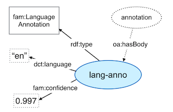
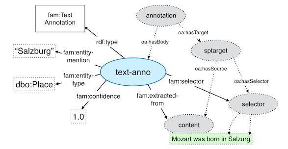
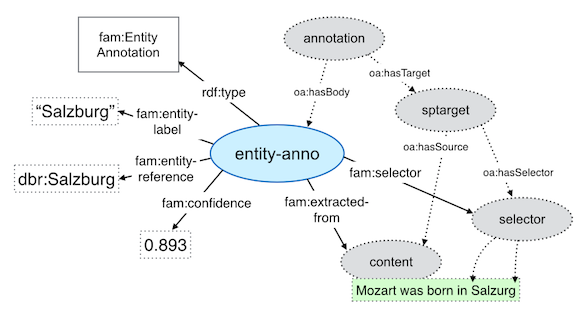
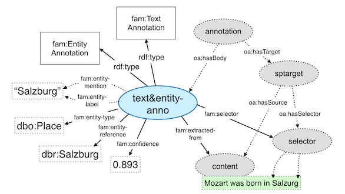
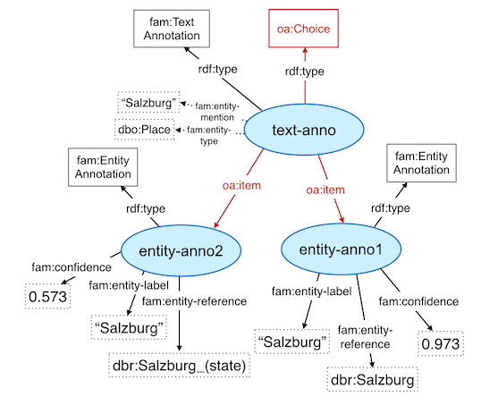
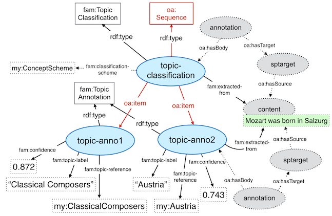
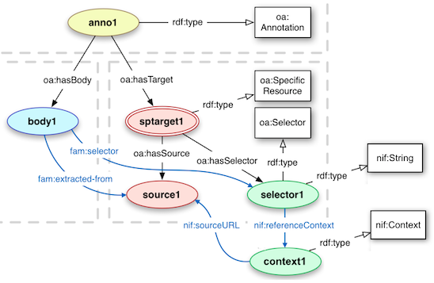

# Fusepool P3 Annotation Model

The Fusepool P3 Annotation Model is used by all Annotator implementations of the Fusepool Plattform. Annotators and transformers together build the components of the Transformation API.

Defining a commonly used model is core of enabling the use and configuration of Annotations workflows - piping different annotators together. It is also important for the consumption of annotation results.

## Usage

The Fusepool P3 Annotation Model is still being defined. All terms will be under the following normative namespace:

    http://vocab.fusepool.info/fam#

Behind that namespece there is not yet a proper RDF vocabulary/ontology defined. But it will be added in the upcoming weeks.

## Design Considerations

For the design of the Fusepool Annotation structure [Open Annotation](http://www.openannotation.org/spec/core/), [NIF 2.0](http://persistence.uni-leipzig.org/nlp2rdf/) and [FISE](http://stanbol.apache.org/docs/trunk/components/enhancer/enhancementstructure.html) where evaluated. 

Based on this evaluation the following design decisions where taken to base the Fusepool Annotation Model on Open Annotation. The main reason was that the high expressiveness of Open Annotation guarantees that all modeling requirements of envisioned usage scenario can be fulfilled. To reduce the additional complexity that comes along with the high expressiveness the Fusepool Annotation Model will introduce some "short cut" relations for typical access strategies (see the next sub-section for more details).

Instead of the Selectors provided by Open Annotation NIF will be used. This is not because NIF provides a better model for selectors, but mainly because by that Fusepool can also take advantage of the capability of formally representing lower level NLP processing results where needed. Doing so using OpenAnnotation is not practical because of the high amount of triples (compared to NIF).

Finally the Fusepool Annotation Model is defined so that Enhancements serialized by using the [Stanbol Enhancement Structure](http://stanbol.apache.org/docs/trunk/components/enhancer/enhancementstructure) can be transformed to the Fusepool model. This is a non functional requirement as existing Stanbol Enhancement Engiens will contribute a major part of the Fusepool transformation functionality.

The following sub-sections will go into details on some of the design considerations mentioned above.

### Expressiveness vs. ease of use 

Open Annotation defines is a very expressive model. While this allows to formulate very complex annotations it also comes with the disadvantage that one needs to follow a lot of indirections for extracting simple things. A good example is getting the selection for an annotation as this requires to traverse over 4 relations and 5 resources. The following listing shows the required relations and resources.

    (1) {annotation-body} <--oa:hasBody-- {annotation}
    (2) {annotation} --oa:hasTarget--> {specific-resource}
    (3) {specific-resource} --oa:hasSource--> {content}
    (4) {specific-resource} --oa:hasSelector--> {selector}
    (5) {selector} definitions
    
The Stanbol Enhancement Structure has a simpler model where annotation and selectors are merged to the same resource (a `fise:TextAnnotation`). Because of that the above request can be answered only by using the Text Annotation resource.

As a tradeoff between both the Fusepool Annotation Structure will define some shortcut relations between `{annotation-body}` and `{content}` as well as the `{selector}`. 

### Transformation from Stanbol Enhancement Structure

_TODO:_ provide more information or remove this subsection

The design of the Fusepool Annotation Model must ensure that a transformation from the [Stanbol Enhancement Structure](http://stanbol.apache.org/docs/trunk/components/enhancer/enhancementstructure) is possible. This ensures that all Enhancement Engines available for Apache Stanbol can be used as transformers in the Fusepool Plattform.

## Annotation Model

This section describes the Annotation Model as used by Fusepool. The annotation model is build upon a core that is fully compatible to Open Annotation. On top of this it defines multiple _Annotation Types_ that are used as `{annotation-body}` of the core models. _Annotation Types_ are extensible meaning that transformers capable of extracting information not covered by the _Annotation Types_ defined in this specification can define/use their own _Annotation Types_. For `{selector}` the Annotation Model preferes to use NIF 2.0 instead of the selectors provided by Open Annotation as this allows to nicely combine high level annotations - described by the different _Annotation Types_ - with lower level NLP annotation that are described much more efficient by NIF.

This chapter first provides the definition of the Annotation code followed by the definition of the different Annotation Types in their own sub-sections. The final section describes how to use NIF in combination with the Fusepool Annotation Model.

### Annotation Core

The core of the Fusepool Annotation Model is build upon [Open Annotation](http://www.openannotation.org/spec/core/). The following figure shows the Open Annotation annotation model including two additional relations as defined by the Fusepool Annotation Model.

As shown by the above figure each Fusepool Annotation has the following elements

* an `{annotation}` resource with the `rdf:type` `oa:Annotation`. This resource also holds all metadata about the annotation process including the provenance information.
* an `{annotation-body}` representing the actual annotation. Different annotation bodies are defined for different types of annotations (e.g. detected language, Named Entities, Linked Entities, Categorizations and Topics). This is also an extension point meaning that special Exractors can define their own annotation types.
* Fusepool always uses a `{sptarget}` - an resource with the `rdf:type` `oa:SpecificResource` as target of annotation. This `{sptarget}` resource is to represent the n-ary relation to the `{content}` ( `source` in Open Annotation terms) and the `{selector}`. 
* As `{selector}` for textual resources the model allows two options:
    1. Transformers can use a combination of the `oa:TextPositionSelector` and the `oa:TextQuoteSelector`. That means that the selector will both provide the start/end char offsets as well as the prefix, exact and suffix information.
    2. NIF 2.0 can be used as selector. The `nif:String` class also provides beginIndex/endIndex char offsets as well as before, anchorOf and after information. However NIF also allows to very efficiently encode NLP annotations. So in use cases where such information are required it is a better alternative to the selectors as provided by Open Annotation. For more information see the final section of this chapter. For compatibility reasons Transformer that do use NIF may also choose to add the properties of the Open Annotation selectors.

To make the consumption of the annotations easier the Fusepool Annotation Model defines the following two relations:

1. `fam:selector` defines a direct relation between the `{annotation-body}` and the `{selector}`. This property is used as shortcut for the following path in the  Open Annotation model: `{annotation-body} <--oa:hasBody-- {annotation} --oa:hasTarget--> {sptarget} --oa:hasSelector--> {selector}` 
2. `fam:extracted-from` defines a direct relation between the `{annotation-body}` and the `{content}`. This property is used as shortcut for the following path in the  Open Annotation model: `{annotation-body} <--oa:hasBody-- {annotation} --oa:hasTarget--> {sptarget} --oa:hasSource--> {content}`

Those two properties are essential for an easy consumption of Annotations assuming use cases that are driven by the annotation bodies. The following listing comparses SPARQL queries for the `{body}`, `{source}` and `{selector}`. To show the difference the first one only uses relations provided by Open Annotation while the second one is exploiting the `fam:selector` and `fam:extracted-from`.

    PREFIX oa: <http://www.w3.org/ns/oa#>

    SELECT ?body ?source ?selector
    WHERE {
        ?annotation a oa:Annotation ;
            oa:hasBody ?body ;
            oa:hasTarget ?sptarget .
        ?body a fam:TextAnnotation ;
            oa:hasBody ?body .
        ?sptarget oa:SpecificResource ;
            oa:hasSource ?source ;
            oa:hasSelector ?selector .
    }

Now the simplified version using `fam:selector` and `fam:extracted-from`:

    PREFIX oa: <http://www.w3.org/ns/oa#>
    PREFIX fam: <http://vocab.fusepool.info/fam#>
    
    SELECT ?body ?source ?selector
    WHERE {
        ?body a fam:TextAnnotation ;
            fam:extracted-from ?source ;
            fam:selector ?selector .
    }

It is also important to note that the 2nd query will execute much faster as it only requires three joins instead of nine.

Finally the core annotation modules also defines `fam:confidence` a property commonly used by all _Annotation Types_ defined in the following sections.
Values of this property are expected to be floating point values in the range [0 .. 1] where `0` represents the lowest confidence and `1` the highest. However values MUST BE interpreted as [Rational Scale](http://en.wikipedia.org/wiki/Ordinal_scale#Ordinal_scale) meaning that only =, ≠, > and < operations may be done on confidence values. This also means that assertion such as an Annotation with an confidence of `0.8` are twice as likely to be correct as one with `0.4` are not possible.  

### Language Annotation

A Language Annotation is used to annotate the language of the parsed content or even the language of an part of the parsed content. The Stanbol Enhancement Structure uses a `fise:TextAnnotation` with the `dct:type` value `dct:LinguisticSystem` for this purpose. The detected language is provided as value of the `dct:language` property. As a `fise:TextAnnotation` is used it is also possible to define a sub-section within the processed document the language was detected for. 

In Fusepool Annotations that describe the language of the processed content are marked by the `fam:LanguageAnnotation` type. This annotation uses the `dct:language` property to provide the detected language.

The following figure shows an Language Annotation for English and an confidence of `0.997`

In the case that multiple language annotations are present for the same section in the text an `oa:Choice` can be used to formally represent the different options.

### Text Annotation

_Text Annotation_ are used to annotate Entity Mentions in the text. Such annotations can originate from different transformer types:

1. Named Entity Recognition (NER): NER is an Natural Language Processing (NLP) technique that detects the mentions of Named Entities of a given Types in texts. Both statistical and rule based systems are possible. NER extractors are usually trained for specific types of entities. Typically they do support Persons, Organizations and Locations but also other types such as Roles, Money, Date/Time ... are common.
2. Entity Mention: In this case an transformer uses some kind of controlled vocabulary (e.g. the list of employees, projects) as a basis to detect mentions of such entities in parsed text.

In both cases tansformers will create a _Text Annotation_ to formally describe the extracted information. Apache Stanbol uses `fise:TextAnnotation` for that purpose. The Fusepool `fam:TextAnnotation` is very similar

* `fam:entity-type`: the general type of the detected entity. Transformers are free to use any type. However it is recommended to use types form well known ontologies such as [NERD](http://nerd.eurecom.fr/ontology), [DBPedia](http://mappings.dbpedia.org/server/ontology/classes/), [Schema.org](http://schema.org/docs/full.html) or similar.
* `fam:entity-mention`: The lexical form of the mention in the text. This is not necessarily the exact literal of the selected section in the text but is expected to represent the mentioned name of the Entity. Examples for deviations from the mention with the selection are due to lemmatization, case corrections, ...

The following figure shows an example of a _Text Annotation_ for Salzburg detected as Named Entity with the type dbpedia Place in the sentence "Mozard was born in Salzburg"

 

The _Text Annotation_ provides direct relations to all information required for typical use cases. Most important the mention `Salzburg` and the type `dbp:Place` of the Named Entity. Also the content and the selector are directly linked. The full annotation structure as defined by Open Annotation is also available and shown by the dotted elements in the figure.

### Entity Annotation

_Entity Annotation_ are used to link/suggest Entities from some controlled vocabulary for mentions - annotated as _Text Annotation_ in analysed text. _Entity Annotation_ are typically created by Entity Linking Extractros. Those are Extractors that are configured with some form of a controlled vocabulary and can link them with _Named Entities_ already detected by some NER Extractor or by directly looking for Entities by matching their labels with the Words in the text.

The following figure shows the base model of `fam:EntityAnnotation`

_Entity Annotation_ define two specific properties. The `fam:entity-label` is expected to provide the label of the linked entity. The language should match the language detected for the document. It is NOT recommended for extractors to add additional information about the Entity to the _Entity Annotation_. The preferred way to provide additional information about linked Entities is to add them directly to the URI of the Entity - or in other words - to dereference (parts) of the Entity information.

It is also possible to combine a _Text Annotation_ with an _Entity Annotation_. A typical scenarion of this is when there is only a single matching Entity for an _Named Entity_ in the text. The following figure gives such an example:

The above figure shows a single `{annotation-body}` typed both as `fam:TextAnnotation` and `fam:EntityAnnotation`. Properties of both Annotation types are used to describe the Entity. In the shown example the `fam:entity-mention` and `fam:entity-label` do have the same value. However those values might be different (e.g. if the text mentions "1st Lieutenant" but the label of the Entity is "First lieutenant").

Case where multiple Entities are possible matches for a _Named Entity_ are described by using the Open Annotation `oa:Choice` concept. In such cases the `{annotation-bofy}` describing the _Named Entity_ is typed as both `fam:TextAnnotation` and `oa:Choice`. All suggested Entities are represented as `fam:EntityAnnotation` and linked by using the `oa:item` relation. The following figure shows an example where the _Entities_ for the "City of Salzburg" and "Salzburg State" are suggested for the _Named Entity_ "Salzburg" in the text. 

Note that both suggestions do have different `fam:confidence` values. Users are expected to use those to sort the multiple suggestions.

### Topic Annotation

_Topic Annotations_ are used to assign categories to a content - or part of the content. _Topic Annotation_ behave differently as _Entity Annotation_ . First assigned categories might not be directly mentioned in the analysed text and second multiple assigned categories do not exclude each others - meaning that a Users is not expected to select a single category as this is the case with multiple _Entity Annotation_ suggested for the same _Text Annotation_.

For the annotation of a topic classification two annotation types are defined. The `fam:TopicClassification` is used to define the classification based on a classification scheme as a `oa:Sequence`. Single classifications based on topics of the used scheme are modelled as `fam:TopicAnnotation` instances. The following figure shows this model based on an example where a text is classified by two topics contained in the same classification scheme.

The `fam:TopicClassification` is defined as `rdfs:subClassOf` `oa:Sequence`. Even so it is recommended to explicitly add both types as clients are not expected to support RDFS reasoning. The _Topic Classification_ concept only defines a single property `fam:classifcation-scheme` that can be used to explicitly define the scheme used for the classification. It is recommended to use [SKOS](http://www.w3.org/2004/02/skos/) to define classification scheme. If SKOS is used the `fam:classifcation-scheme` is expected to link the the `skos:ConceptScheme` instance. In case a _Topic Classification_ does use multiple schemes multiple `fam:classifcation-scheme` will be present.

For the annotation of extracted topics `fam:TopicAnnotation` are used. The `fam:topic-reference` is used to link to the URI of the topic (in case of SKOS a `skos:Concept` instance). The `fam:topic-label` holds the label of the topic. In case extracted topics are just defined by strings (and not formally defined as concepts) _Topic Annotation_ will just define the `fam:topic-label` property.

Additional information about linked _Topics_ should not be added to the _Topic Annotation_. If such information are desired they should be directly added to the URI of the linked _Topic_ - or in other words - used parts of the Thesaurie shall be dereferenced to the RDF graph with the annotations.

### NIF 2.0 Integration

This section provides information on how to use [NIF 2.0](http://persistence.uni-leipzig.org/nlp2rdf/) with the Fusepool Annotation Model. 

The integration between NIF 2.0 and the Open Annotation based Fuespool Annotation Model follows the recommendation of the _NIF OA_ (NIF Open Annotation) profile. As defined by this profile the main integration point between NIF and Open Annotation is the `oa:Selector`. 

The following figure outlines that integration with the Fusepool Annotation Model

 Fusepool Annotation Bodies will refer `nif:String` instances by using the `fam:selector` property. The `nif:String` instance will provide the text selection information but may also provide additional NLP annotations like lemma, pos tag, sentiment values ...

NIF defines an elegant and also very efficient model for describing such NLP annotations. By only using a single `nif:Context` instance representing the text of the document as a whole and one `nif:String` instance for every annotation of a specific selection of the text.

The key feature that allows this is the usage of a fixed URI Scheme to generate unique identifier based on the selected text. By using such an URI Scheme different NLP annotation components writing annotations for the same selection are guaranteed to use the same resource identifier. So information written by such components will automatically be integrated on the RDF level. This feature is nicely shown in the following figure taken from the paper [Integrating NLP using Linked Data](http://svn.aksw.org/papers/2013/ISWC_NIF/public.pdf)

The same feature is also key for serializing the Fusepool Annotation Model as they just need to use available information about the selection to generate the `nif:String` instance used as `{selector}`
    <#char=3,12>
        a nif:String;
        nif:anchorOf favourite;
        nif:referenceContext <#char=0>;
        nif:beginIndex "3"^^xsd:int;
        nif:endIndex "12"^^xsd:int;

Any other NLP annotation using the NIF format will be automatically be integrated with those `{selectors}` That means that the component generating the Fusepool Annotation Model is fully independent of any other components providing NIF annotations.

## Transformation of FISE to the Fusepool Annotation Model

This section describes transformation instructions for the [FISE enhancement Structure]() to Open Anotation.

### fise:Enhancement transformation

`fise:Enhancement` instances are represented by `oa:Annotation`. This means that an `{annotation}` instance will be created. The following metadata are added to the `{annotation}` instance

* `dct:created` is mapped to `oa:annotatedAt`
* `dct:modified` is copied as is
* `dct:creator` is mapped to `oa:annotatedBy`
* `dct:contributor` is also mapped to `oa:annotatedBy`
* the `oa:serializedAt` property is set to the current time of the transformation
* the `oa:serializedBy` property is set to the enhancement engine performing the transformation

In addition a `{sptarget}` with the `rdf:type` `oa:SpecificResource` is created for each `fise:Enhancement`. The `fise:extracted-from` is mapped to `oa:hasSource` meaning that the URI of the _Content Item_ is set as source of the annotation.

### fise:TextAnnotation transformation

As `fise:TextAnnotation` are used in Stanbol for different annotation types for the Fusepool Annotation model the mappings are not only applied based on the type but also based on the values of other properties. This section will first describe general mapping rules and later define specific rules for different types in own sub-sections.

Every `fise:TextAnnotation` is also a `fise:Enhancement`. So based on the  [mapping rules for fise:Enhancements](#fiseenhancement_transformation) a `{annotation}` and a `{sptarget}` is created. The URI used by the `fise:TextAnnotation` is used for the `{annotation-body}` that is referenced by `oa:hasBody` from the `{annotation}`

`fise:TextAnnotation` may select parts of the content. This is indicated by the presence of both the `fise:start` and `fise:end` property. For all `fise:TextAnnotation` that define a selection a `{selector}` resource is created and linked with `oa:hasSelector` from the `{sptarget}`. 

For the `{selector}` there are two possible Options. First to generate a `oa:TextPositionSelector` and `oa:TextQuoteSelector` or second to use a [NIF 2.0](http://persistence.uni-leipzig.org/nlp2rdf/) selector. Both selectors do provide similar information but different properties are used.

In any case the URI of the `{selector}` is generated by appending a [RFC 5147](http://tools.ietf.org/html/rfc5147) based URI fragments - as used by [NIF 2.0](http://persistence.uni-leipzig.org/nlp2rdf/) - to the URI of the `{content-item}`

In case an OpenAnnotation selector is serialized the following mapping rules apply

* The `{selector}` uses the `rdf:type` `oa:TextPositionSelector` and `oa:TextQuoteSelector` types
* `fise:start` mapped to `oa:start`
* `fise:end` mapped to `oa:end`
* `fise:selected-text` mapped to `oa:exact`. _NOTE_ if `fise:selection-head` and `fise:selection-tail` are used instead of `fise:selected-text` they are copied to the selector and `oa:exact` will be missing.
* `fise:selection-prefix` mapped to `oa:prefix`
* `fise:selection-suffix` mapped to `oa:suffix`

In case an NIF 2.0 selector is serialized the following set of rules need to be used

* The `{selector}` uses the `rdf:type` `nif:String`
* `fise:start` mapped to `nif:beginIndex`
* `fise:end` mapped to `oa:endIndex`
* `fise:selected-text` mapped to `nif:anchorOf`. _NOTE_ in case `fise:selection-head` and `fise:selection-tail` are used instead of `fise:selected-text` the `nif:head` and `nif:tail` properties must be used instead of `nif:anchorOf`.
* `fise:selection-prefix` mapped to `nif:before`
* `fise:selection-suffix` mapped to `nif:after`
* Add a `nif:referenceContext` relation to `<{content-item}#char=0>`. The `<{content-item}#char=0>` need to be created once for every `{content-Item}` with the following properties
    * `rdf:type` set to `nif:Context` and `nif:RFC5147String`. The second type specified the used URL Scheme for all `nif:String` instances using this as a `nif:referenceContext`.
    * `nif:sourceUrl` referring the `{content-item}`

Implementors may support an option to switch between both sets of rules. In some cases it might also make sense to use both mapping sets for compatibility reasons.

#### fam:LanguageAnnotation transformation

`fise:TextAnnotation` with the `dct:type` `dct:LinguisticSystem` are mapped to `fam:LanguageAnnotation` instances by using the following mappings:

* the `{annotation-body}` does use the `rdf:type` `fam:LanguageAnnotation`
* `dct:language` as defined by the `fise:TextAnnotation`
* `fise:confidence` mapped to `fam:confidence`

#### fam:TopicClassification transformation

`fise:TextAnnotation` with an incoming `dct:relation` from an `fise:TopicAnnotation` instance are mapped to `fam:TopicClassification` instances. In such cases the following mappings apply

* the `{annotation-body}` does use the `rdf:type` `fam:TopicClassification` and `oa:Sequence`
* the `fam:classification-scheme` property will not be set as this information is not available
* `fise:confidence` (if present) is mapped to `fam:confidence`

#### fam:TextAnnotation transformation

All remaining `fise:TextAnnotation` can be converted to `fam:TextAnnotation` instances. For this transformation the following mappings apply:

* `fise:selected-text` is mapped to `fam:entity-mention`
* `dct:type` is mapped to `fam:entity-type`
* `fise:confidence` is mapped to `fam:confidence`

_NOTE:_ that the `oa:Choice` type is added to the `fam:TextAnnotation` when mapping `fise:EntityAnnotation` instances.
    
### fise:EntityAnnotation transformation

All `fise:EntityAnnotation` instances are transformed to `fam:EntityAnnotation`. 

Typically `fise:EntityAnnotation` are linked with `dct:related` to one or more `fise:TextAnnotation`. Those `fise:TextAnnotation` define the mentions of the Entity in the analysed text. In FISE Entity Annotation do not define their own selector as the selection is provided by the linked Entity Annotation. Open Annotation does use a different model, where the `{annotation-body}` for the `fam:EntityAnnotation` will link to all `{selector}` instances for its mentions. Based on the mapping rules for [Entity Annotation](#fiseentityannotation_transformation) such `{selector}` instances are already written and SHOULD BE reused while transforming the `fise:EntityAnnotation`

When transforming `fise:EntityAnnotation` one needs also to modify `fam:TextAnnotation` for linked `fise:TextAnnotation`. For that it is important to not that those `fam:TextAnnotation` instances will use the same URIs as the original `fise:TextAnnotation`. So when transforming `fise:EntityAnnotation` one needs to add the `oa:Choice` type to `fam:TextAnnotation` with the same URI as `fise:TextAnnotation` referenced with the `dct:relation` property. One needs also to write a `oa:item` relation between those `fam:TextAnnotation` instances and the transformed `fam:EntityAnnotation`.

In the following are the complete transformation rules for `fise:EntityAnnotation` instances:

1. Every `fise:EntityAnnotation` is also a `fise:Enhancement`. So based on the  [mapping rules for fise:Enhancements](#fiseenhancement_transformation) a `{annotation}` and a `{sptarget}` is created. The `{sptarget}` links with the `oa:hasSource` to the URI of the `{content-item}`. At this stage no `{selector}` are created.
2. The URI used by the `fise:EntityAnnotation` is used for the `{annotation-body}` that is referenced by `oa:hasBody` from the `{annotation}`. The `{annotation-body}` gets the `rdf:type` `fam:EntityAnnotation`. The following property mappings apply for the `{annotation-body}`
    * `fise:entity-reference` is mapped to `fam:entity-reference`
    * `fise:entity-label` is mapped to `fam:entity-label`
    * `fise:entity-type` is not mapped as the new annotation model does not provide type information as part of the `fam:EntityAnnotation`. Implementors may provide an option to copy `fise:entity-type` values over to the `fam:EntityAnnotation`.
    * if present the `entityhub:site` property referring the Entityhub site holding the controlled vocabulary is copied over to the `fam:EntityAnnotation`.
    * `fise:confidence` is mapped to `fam:confidence`
    * `fise:extracted-from` is mapped to `fam:extracted-from`. It provides a shortcut from the `{annotation-body}` to the `{content-item}`
3. For all `fise:TextAnnotation` instances linked via `dct:related` the following transformations need to be preformed
    * The `rdf:type` `oa:Choice` has to be added to the `fam:TextAnnotation` with the same URI as the processed `fise:TextAnnotation`
    * The `fam:TextAnnotation` with the same URI as the processed `fise:TextAnnotation` needs to be connected to the `fam:EntityAnnotation` by using `oa:item`.
    * All `{selector}` instances referenced by the `fam:TextAnnotation` with the same URI as the processed `fise:TextAnnotation` need also to be referenced with both `{sptarget} oa:hasSelector {selector}` and `{annotation-body} fam:selector {selector}`. This ensures that the `fam:EntityAnnotation` defines selector for all its mentions in the analyzed text
    
### fise:TopicAnnotation transformation

FISE uses `fise:TopicAnnotation` instances linked to a `fise:TextAnnotation` for representing topic classifications of a document (or parts of a document if the Text Annotation selects parts of the text). The Fusepool Annotation Model defines the `fam:TopicClassification` and the `fam:TopicAnnotation` for that purpose.

Mapping rules for `fise:TextAnnotation` with linked `fise:TopicAnnotation` to `fma:TopicClassification` are already define in an [earlier section](#famTopicClassification_transformation). This section specifies how to transform the `fise:TopicAnnotation` to `fam:TopicAnnotation` instances.

In the following are the complete transformation rules for `fise:TopicAnnotation` instances:

1. Every `fise:TopicAnnotation` is also a `fise:Enhancement`. So based on the  [mapping rules for fise:Enhancements](#fiseenhancement_transformation) a `{annotation}` and a `{sptarget}` is created. The `{sptarget}` links with the `oa:hasSource` to the URI of the `{content-item}`. At this stage no `{selector}` are created.
2. The URI used by the `fise:TopicAnnottion` is used for the `{annotation-body}` that is referenced by `oa:hasBody` from the `{annotation}`. The `{annotation-body}` gets the `rdf:type` `fam:TopicAnnotation`. The following property mappings apply for the `{annotation-body}` 
    * `fise:entity-reference` is mapped to `fam:topic-reference`
    * `fise:entity-label` is mapped to `fam:topic-label`
    * `fise:entity-type` is not mapped as the new annotation model does not provide type information as part of the `fam:TopicAnnotation`. Implementors may provide an option to copy `fise:entity-type` values over to the `fam:EntityAnnotation`.
    * if present the `entityhub:site` property referring the Entityhub site holding the thesaurus.
    * `fise:confidence` will also be added to the `{annotation-body}`
    * `fise:extracted-from` is mapped to `fam:extracted-from`. It provides a shortcut from the `{annotation-body}` to the `{content-item}`
3. For all `fise:TopicAnnotation` instances linked via `dct:related` the following transformations need to be preformed
    * This expects that a `fam:TopicClassification` was already created for the URI of the linked `fise:TextAnnotation`. If this is not the case this transformation has to be performed as described in the [fam:TopicClassifcation transformation](#famTopicClassification_transformation) section.
    * The `fam:TopicClassification` needs to be connected to the `fam:EntityAnnotation` by using `oa:item`
    * All `{selector}` instances referenced by the `fam:TopicClassification` need also to be referenced with both `{sptarget} oa:hasSelector {selector}` and `{annotation-body} fam:selector {selector}`. This ensures that the `fam:TopicAnnotation` defines the selector for the classified part of the document.

